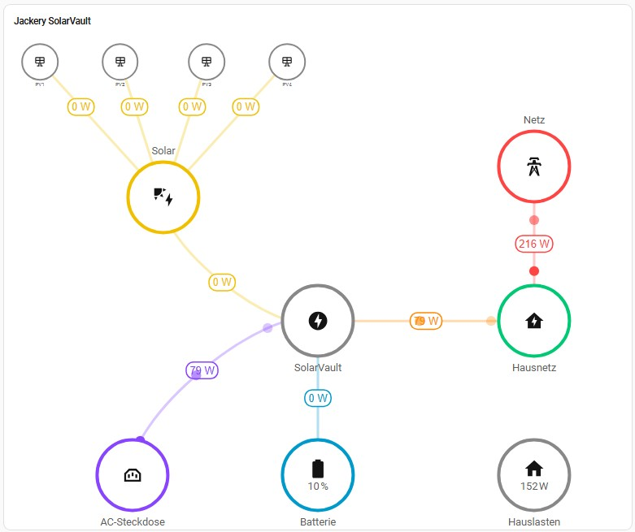
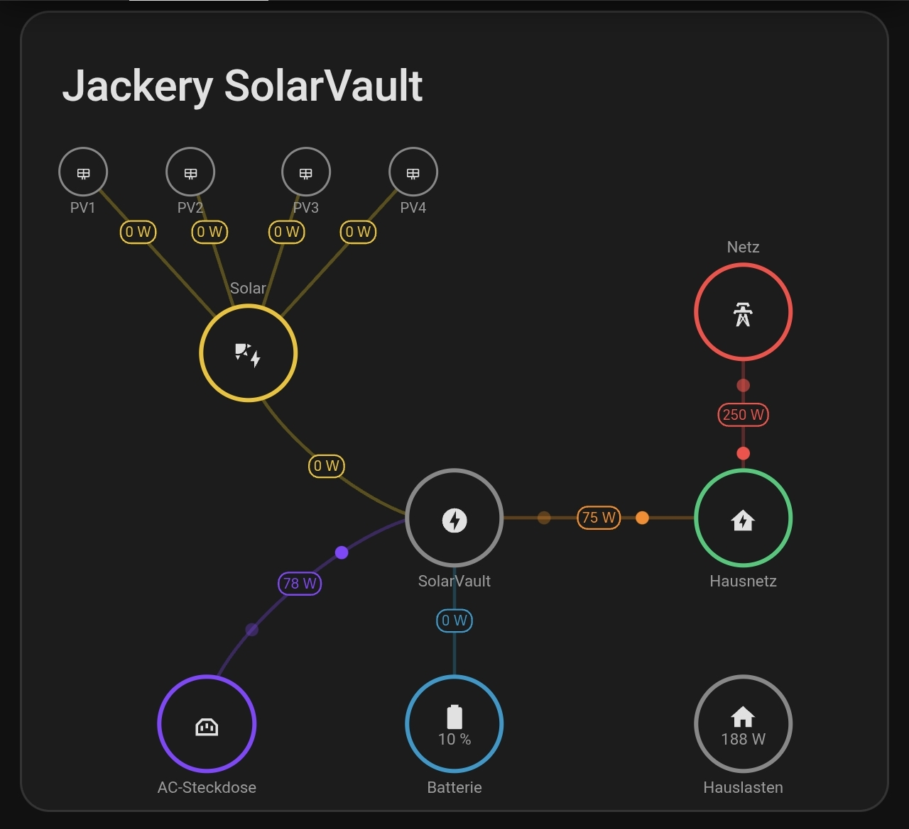

# Energy Flow Visualization with ha-freeflow

This document describes how to configure a [ha-freeflow](https://github.com/csoscd/ha-freeflow) card
to visualize the energy topology of a hybrid solar storage system (e.g. a device with PV inputs, AC output,
battery storage, EPS output, and grid interaction).

## Screenshots

### Desktop



### Mobile



---

## Topology

The card models the following energy topology:

```
PV1  PV2  PV3  PV4
  \   |   |   /
       Solar
         |
       SolarVault ──── Hausnetz ──── Grid
         |    \            |
       Battery  AC Output  Home Loads
```

| Node | Role |
|---|---|
| PV1–PV4 | Individual PV inputs (smaller nodes, size 6) |
| Solar | Aggregated PV output (collector node) |
| SolarVault | The central hybrid inverter/storage device |
| Hausnetz | House grid junction (AC output + grid import meet here) |
| Grid | Public utility grid |
| Battery | Battery storage (shows SOC only) |
| AC Output | EPS / pass-through AC socket output |
| Home Loads | Estimated total home consumption |

---

## Required Sensors

### Device sensors (replace with your integration's entity IDs)

| Generic name | Description |
|---|---|
| `sensor.device_pv1_power` | PV input 1 power (W) |
| `sensor.device_pv2_power` | PV input 2 power (W) |
| `sensor.device_pv3_power` | PV input 3 power (W) |
| `sensor.device_pv4_power` | PV input 4 power (W) |
| `sensor.device_solar_power` | Total aggregated PV power (W) |
| `sensor.device_ac_output_power` | AC output power into house grid (W, always ≥ 0) |
| `sensor.device_ac_input_power` | AC input power drawn from house grid (W, always ≥ 0) |
| `sensor.device_eps_output_power` | EPS / pass-through output power (W) |
| `sensor.device_battery_net_power` | Battery net power (W); negative = charging, positive = discharging |
| `sensor.device_battery_soc` | Battery state of charge (%) |
| `sensor.device_home_load_power` | Estimated home consumption (W) |
| `sensor.smartmeter_grid_import_power` | Smart meter: net grid import power (W) |

### Template helper: net AC power

The flow between the SolarVault and the house grid junction is bidirectional.
Rather than using two separate flows, create a single **signed** template sensor:

```yaml
# Settings → Devices & Services → Helpers → Add Helper → Template → Sensor
name: "Device AC Net Power"
state: >
  {{ (states('sensor.device_ac_output_power') | float(0))
   - (states('sensor.device_ac_input_power') | float(0)) }}
unit_of_measurement: W
device_class: power
state_class: measurement
```

- **Positive** → device feeds power into the house grid (animation: SolarVault → Hausnetz)
- **Negative** → device draws power from the house grid (animation: Hausnetz → SolarVault)

> **Note on update frequency:** If your integration exposes both `ac_output_power` and an equivalent
> OnGrid power sensor, prefer the sensor with higher update frequency for dashboards.

---

## Complete Card Configuration

```yaml
type: custom:ha-freeflow-card
title: Solar Storage System
view_height: 80

defaults:
  flow_style: dots
  color_positive: "#00c875"
  color_negative: "#ff4444"
  size: 12
  node_color: "#888"

nodes:
  # ── PV inputs (small nodes, half size, above the Solar collector) ──────────
  - id: pv1
    label: PV1
    icon: mdi:solar-panel
    x: 5
    y: 5
    size: 6
    entities: []

  - id: pv2
    label: PV2
    icon: mdi:solar-panel
    x: 18
    y: 5
    size: 6
    entities: []

  - id: pv3
    label: PV3
    icon: mdi:solar-panel
    x: 32
    y: 5
    size: 6
    entities: []

  - id: pv4
    label: PV4
    icon: mdi:solar-panel
    x: 45
    y: 5
    size: 6
    entities: []

  # ── Row 1: Solar collector + Grid ─────────────────────────────────────────
  - id: solar
    label: Solar
    icon: mdi:solar-power
    x: 25
    y: 27
    color: "#f0c000"
    label_position: above
    entities: []           # value is shown on flows, not in the node

  - id: grid
    label: Grid
    icon: mdi:transmission-tower
    x: 85
    y: 22
    color: "#ff4444"
    label_position: above
    entities: []

  # ── Row 2: SolarVault (central device) + Hausnetz junction ────────────────
  - id: battery
    label: SolarVault
    icon: mdi:lightning-bolt-circle
    x: 50
    y: 47
    entities: []           # no value displayed on node

  - id: hausnetz
    label: Hausnetz
    icon: mdi:home-lightning-bolt
    x: 85
    y: 47
    color: "#00c875"
    entities: []

  # ── Row 3: Battery storage + AC Output + Home Loads ───────────────────────
  - id: akku
    label: Battery
    icon: mdi:battery
    x: 50
    y: 72
    color: "#0099cc"
    entities:
      - entity: sensor.device_battery_soc   # SOC only, no watt value

  - id: eps
    label: AC Output
    icon: mdi:power-socket
    x: 20
    y: 72
    color: "#8844ff"
    entities: []

  - id: home
    label: Home Loads
    icon: mdi:home
    x: 85
    y: 72
    entities:
      - entity: sensor.device_home_load_power
        decimals: 0
        unit: W

flows:
  # ── PV inputs → Solar collector ───────────────────────────────────────────
  - from: pv1
    to: solar
    sensor: sensor.device_pv1_power
    color_positive: "#f0c000"
    line_style: straight
    show_value: true
    value_position: start   # value label near the PV node

  - from: pv2
    to: solar
    sensor: sensor.device_pv2_power
    color_positive: "#f0c000"
    line_style: straight
    show_value: true
    value_position: start

  - from: pv3
    to: solar
    sensor: sensor.device_pv3_power
    color_positive: "#f0c000"
    line_style: straight
    show_value: true
    value_position: start

  - from: pv4
    to: solar
    sensor: sensor.device_pv4_power
    color_positive: "#f0c000"
    line_style: straight
    show_value: true
    value_position: start

  # ── Solar → SolarVault ────────────────────────────────────────────────────
  - from: solar
    to: battery
    sensor: sensor.device_solar_power
    color_positive: "#f0c000"
    show_value: true

  # ── SolarVault ↔ Hausnetz (bidirectional via net sensor) ─────────────────
  # Positive: device feeds house grid  → animation SolarVault → Hausnetz (green)
  # Negative: device draws from grid   → animation Hausnetz → SolarVault (orange)
  - from: battery
    to: hausnetz
    sensor: sensor.device_ac_net_power   # template sensor (see above)
    color_positive: "#00c875"
    color_negative: "#ff8800"
    line_style: straight
    show_value: true

  # ── Grid ↔ Hausnetz (always red, grid import is always positive) ──────────
  - from: grid
    to: hausnetz
    sensor: sensor.smartmeter_grid_import_power
    color_positive: "#ff4444"
    color_negative: "#ff4444"   # red in both directions
    line_style: straight
    show_value: true

  # ── SolarVault → AC Output (EPS) ──────────────────────────────────────────
  - from: battery
    to: eps
    sensor: sensor.device_eps_output_power
    color_positive: "#8844ff"
    show_value: true

  # ── Battery storage ↔ SolarVault ──────────────────────────────────────────
  # Positive: battery discharging → blue
  # Negative: battery charging   → yellow/gold
  - from: akku
    to: battery
    sensor: sensor.device_battery_net_power
    color_positive: "#0099cc"
    color_negative: "#f0c000"
    line_style: straight
    show_value: true

grid_options:
  columns: 24
  rows: auto
```

---

## Design Decisions

### Node sizing
PV input nodes use `size: 6` (half the default `size: 12`). This visually signals that
they are sub-components feeding into the Solar collector, not primary topology nodes.

### Color scheme
Each node and its connected flows share a color, making the energy path immediately readable:

| Color | Meaning |
|---|---|
| `#f0c000` yellow | Solar / PV energy |
| `#00c875` green | AC output / self-sufficiency |
| `#ff4444` red | Grid import |
| `#ff8800` orange | Device drawing from house grid |
| `#0099cc` blue | Battery discharging |
| `#8844ff` purple | EPS / AC socket output |
| `#888` gray | Neutral nodes (SolarVault, Hausnetz) |

### Values on flows, not nodes
All watt values are displayed on flow lines (`show_value: true`) rather than inside nodes.
Nodes only show state-of-charge (battery) or home load. This keeps the topology readable
even when many flows are active simultaneously.

### view_height
Set `view_height: 80` to match the lowest node row (y=72) plus half the default node
diameter (size 12 → radius 6). This enables `rows: auto` in `grid_options` without the
white-space bleed issue caused by SVG `height: 100%`.

### label_position: above
Applied to nodes in the top area of the canvas (Solar, Grid) to prevent labels from
overlapping with flow lines running below them.
